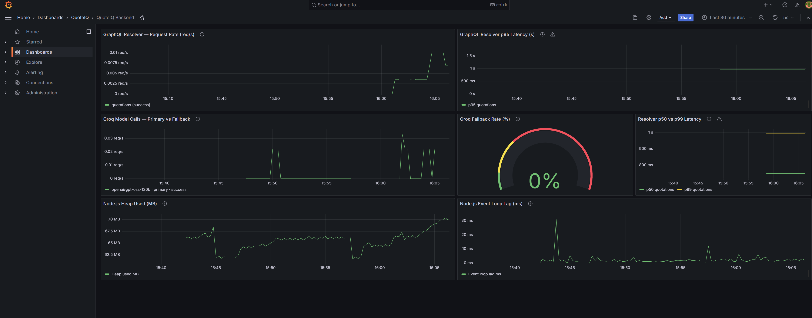
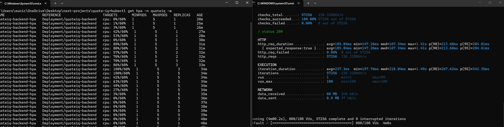

# QuoteIQ

A B2B quotation management platform with AI-powered insights for sales teams.

**Live demo:** https://quoteiq.cc  
Demo credentials: Manager `marcus@quoteiq.com` / Sales Rep `anna@quoteiq.com` — password `password123` (intentionally weak demo-only seed, controlled by `SEED_PASSWORD` in `.env`)

---

## Stack

| Layer | Technology |
|---|---|
| Frontend | React 18 · TypeScript · Tailwind CSS · Apollo Client |
| Backend | NestJS · GraphQL (Apollo Server, code-first) · Prisma ORM |
| Database | PostgreSQL (Neon DB — serverless, WebSocket driver) |
| Auth | JWT in HttpOnly cookies · Role-based access control |
| AI | Groq API (Llama 3.3 70B) · Zod response validation |
| Infra | Railway (backend) · Vercel (frontend) · Neon DB (EU — Frankfurt) |

---

## Architecture Decisions

**NestJS over Express** — NestJS enforces a module/resolver/service structure with decorator-based dependency injection. Express is unopinionated and doesn't scale well across large teams. NestJS mirrors enterprise team organisation patterns and is TypeScript-first throughout.

**Separated React + NestJS over Next.js** — Separated frontend/backend architecture aligns with EU data residency compliance requirements, microservice patterns, and team organisation. The GraphQL API layer makes the separation clean and allows each layer to be deployed, scaled, and maintained independently.

**GraphQL over REST** — single endpoint, client specifies exact data needed, strongly typed schema shared between frontend and backend. Reduces overfetching on quotation list views where only summary fields are needed.

**JWT in HttpOnly cookies over localStorage** — prevents XSS token theft. Apollo Client sends the cookie automatically via `credentials: 'include'` — no manual header management needed.

**Neon WebSocket driver over pg pool** — Neon free tier pauses compute after 5 minutes of inactivity. The `PrismaNeon` WebSocket adapter maintains a lightweight connection and supports full Prisma transactions (implicit and explicit), including nested writes and `update+include`. A 4-minute keepalive ping prevents cold starts on the free tier. The initial implementation used `PrismaNeonHttp` (stateless HTTP per query) but was switched to `PrismaNeon` when nested Prisma writes — which use implicit transactions — failed with "Transactions are not supported in HTTP mode".

**Groq over Gemini** — Groq's free tier runs Llama 3.3 70B on dedicated inference hardware with significantly better availability than Gemini's free tier. The `callGroq()` helper walks through a ranked model list (Llama 3.3 70B → Llama 3.1 8B → Mixtral) and automatically fails over on 503/429 errors — self-healing without manual intervention.

**Railway over Render** — Railway supports Docker-based deploys which gives full control over the runtime environment, and has better free-tier reliability than Render (no spin-down on inactivity).

---

## Known Limitations

These are deliberate scope decisions for a portfolio build, not oversights.

**No Client entity** — `clientName` is a free-text field rather than a relational `Client` model. The differentiator here is the quoting intelligence (rules engine, LLM validation, Zod safety, prompt injection guards), not CRM breadth.

**Email notifications via Mailtrap** — Status transitions fire transactional emails: DRAFT→SENT notifies all Sales Managers, SENT→APPROVED/REJECTED notifies the rep. Delivered via Nodemailer + [Mailtrap Email Sandbox](https://mailtrap.io) (catches all outgoing mail in a safe inbox — no real emails sent). In production this would swap to a live SMTP provider (SendGrid, Resend, etc.) by updating the `MAIL_*` env vars.

**No GDPR data subject flows** — There are no "export my data" or "delete my account" self-service endpoints. Data deletion is covered structurally (cascade deletes on all related records) but a full Article 17/20 implementation is out of scope.

**Login password as GraphQL argument** — The `login` mutation accepts `password` as a plain GraphQL variable. In production this would move to a dedicated REST `POST /auth/login` endpoint where the body sits outside GraphQL variable logging by default.

---

## Features

### Implemented
- Sales reps create quotations with a free-text client name and line items with tax calculation
- Auto-generated quotation numbers via PostgreSQL sequence (`QT-2026-0001`)
- Status workflow: DRAFT → SENT (rep submits for approval) → APPROVED / REJECTED (manager)
- Role-based transition enforcement — SALES_REP cannot approve or reject (blocked at service layer)
- Full audit trail via `StatusHistory` — creation, every edit (fields changed listed in note), and every status transition logged with actor and timestamp; timeline visible on quotation detail
- Quotation list filtering — status dropdown + debounced search (title, number, client name) with input sanitization (trim + 100-char cap at both frontend and backend)
- Manager dashboard with pipeline stats, conversion rate, and approved value
- AI-generated quotation summary with PROCEED / FOLLOW_UP / RECONSIDER recommendation
- Hybrid recommendation model — rules-based scoring anchors the Groq prompt, hard override prevents AI from reversing a RECONSIDER verdict
- 24-hour insight cache — avoids redundant API calls on repeated views
- Conversion likelihood score badge on SENT quotations (0–100, HIGH/MEDIUM/LOW) — deterministic, cached 24h
- Win/loss analysis page (managers only) — overall approval rate, avg deal sizes, breakdown by rep and deal-size bucket (`<5k`, `5k–20k`, `>20k`), cached 1h
- Natural language Q&A on quotation detail (managers only) — ask free-text questions about a specific quotation; Groq answers in 2–4 sentences scoped strictly to that quotation's data via system/user message split
- Edit quotation (DRAFT only) — reuses create modal with pre-populated fields, rep ownership enforced
- Status history timeline on quotation detail — every status transition logged with actor, timestamp, and optional note
- Demo credentials gate via `VITE_SHOW_DEMO_CREDENTIALS` env var
- Quotation list pagination — "Load more" appends the next page (20 per page, `take`/`skip` at API level)
- Win/Loss aggregation fully in SQL — `GROUP BY` status and rep, conditional aggregation for deal-size buckets; no full table scan into application memory
- Rate limiting — 120 requests/minute per IP via `@nestjs/throttler`; custom `GqlThrottlerGuard` extracts the request from the GraphQL execution context (the default `ThrottlerGuard` only handles HTTP context)
- URL-based routing via `react-router-dom` v7 — bookmarkable URLs, working browser back button, deep-linking to quotation detail pages

---

## AI Architecture

The quotation summary uses a **hybrid model**:

1. **Rules engine** (`computeRecommendation`) scores the deal using client history — rejection rate > 60% → RECONSIDER, approval rate > 60% and deal within ±20% of average → PROCEED, else FOLLOW_UP
2. **Groq** receives the structured data plus the computed recommendation as an anchor — it can read unstructured signals (notes, line item descriptions) and override the rules, but only to upgrade or provide nuance
3. **Hard override** — if rules say RECONSIDER, that verdict is locked regardless of Groq output. Structured data cannot be overridden by qualitative reads
4. **Zod validates** every AI response before it's used — TypeScript types don't protect at runtime
5. **Prompt injection protection** — user-supplied content (notes, item descriptions, client name) is isolated inside `<quotation_data>` and `<client_data>` XML tags with explicit instructions to treat tag contents as data only
6. **Self-healing fallback** — if the primary model (Llama 3.3 70B) is overloaded, the service automatically retries with Llama 3.1 8B then Mixtral 8x7B
7. **Scoped NL Q&A** — `askAboutQuotation` uses the system/user message split to confine Groq strictly to one quotation's data; off-topic questions receive a fixed refusal without any additional DB query

---

## Getting Started

```bash
# Backend
cd backend
cp .env.example .env        # fill in your values
npm install
npx prisma migrate dev
npx prisma db seed
npm run start:dev

# Frontend
cd frontend
cp .env.example .env.local  # fill in your values
npm install
npm run dev
```

---

## Environment Variables

**Backend** (`backend/.env`):

```bash
DATABASE_URL=""           # PostgreSQL connection string (e.g. from Neon DB)
JWT_SECRET=""             # Any long random string
JWT_EXPIRES_IN="7d"       # Token expiry — supports 7d, 24h, 30m etc.
GROQ_API_KEY=""           # Groq API key — free at console.groq.com
SEED_PASSWORD=""          # Password set for all seeded demo users (default: password123)
PORT=5000
NODE_ENV="development"
CORS_ORIGIN="http://localhost:5173"   # Comma-separated list of allowed frontend origins
LOG_LEVEL="info"
```

**Frontend** (`frontend/.env.local`):

```bash
VITE_API_URL="http://localhost:5000/graphql"   # Backend GraphQL endpoint
VITE_SHOW_DEMO_CREDENTIALS="true"              # Show demo login credentials on the login page
```

---

## Roles

| Role | Access |
|---|---|
| SALES_REP | Own quotations only. Can create (with free-text client name) and submit DRAFT → SENT for manager approval |
| SALES_MANAGER | Full team visibility. Can approve/reject SENT quotations. Access to AI features and dashboard |

---

## Seed Data

```bash
npx prisma db seed
```

Creates two roles (SALES_MANAGER and SALES_REP), three demo users (one manager, two sales reps), and sample quotations with varied client names, statuses, and amounts. The seed password is controlled by `SEED_PASSWORD` in `.env` — defaults to `password123` if not set.

---

## Project Structure

```
quote-iq/
├── .github/workflows/      # CI/CD — test, build, deploy
├── backend/
│   ├── prisma/
│   │   ├── migrations/
│   │   ├── schema.prisma
│   │   └── seed.ts
│   └── src/
│       ├── common/
│       │   ├── decorators/  # @CurrentUser, @Roles
│       │   ├── guards/      # JwtAuthGuard, RolesGuard, GqlThrottlerGuard
│       │   ├── logger/      # Winston logger
│       │   └── metrics/     # MetricsModule — Prometheus Histogram + Counter providers
│       ├── modules/
│       │   ├── ai/          # Groq integration, hybrid recommendation model
│       │   ├── auth/        # JWT, HttpOnly cookie, passport-jwt
│       │   ├── dashboard/
│       │   ├── quotations/
│       │   └── users/
│       └── prisma/          # PrismaService with Neon WebSocket adapter + keepalive ping
├── frontend/
│   └── src/
│       ├── components/      # AIInsightCard, CreateQuotationModal, Layout
│       ├── context/         # AuthProvider, auth-context
│       ├── graphql/         # queries.ts, mutations.ts
│       ├── hooks/           # useAuth
│       ├── lib/             # Apollo client
│       └── pages/           # Dashboard, Quotations, QuotationDetail, WinLoss, Login
├── docs/
│   ├── cicd-flow.md         # Mermaid CI/CD diagram (renders on GitHub)
│   └── drawio/              # Architecture, ERD, sequence, AI pipeline diagrams
├── observability/
│   ├── prometheus.yml       # Scrape config — backend /metrics every 15s
│   └── grafana/
│       └── provisioning/    # Auto-loaded datasource (Prometheus) + dashboard JSON
└── README.md
```

---

## Diagrams

Draw.io source files are in [`docs/drawio/`](docs/drawio/). Open with [Draw.io Desktop](https://github.com/jgraph/drawio-desktop/releases) or the [VS Code Draw.io Integration](https://marketplace.visualstudio.com/items?itemName=hediet.vscode-drawio) extension.

| Diagram | File | Description |
|---|---|---|
| HLD — System Architecture | [hld-system-architecture.drawio](docs/drawio/hld-system-architecture.drawio) | Full deployment topology — browser, Vercel, Railway, Neon DB, Groq |
| LLD — NestJS Module Architecture | [lld-nestjs-module-architecture.drawio](docs/drawio/lld-nestjs-module-architecture.drawio) | Internal module structure — resolver → service → Prisma, guard chain |
| ERD — Data Model | [erd-data-model.drawio](docs/drawio/erd-data-model.drawio) | All 6 tables with fields, types, indexes, and FK relationships |
| Auth Flow | [sequence-auth-flow.drawio](docs/drawio/sequence-auth-flow.drawio) | Login, authenticated request, page refresh session restore, logout |
| Request Lifecycle | [sequence-request-lifecycle.drawio](docs/drawio/sequence-request-lifecycle.drawio) | GraphQL request from browser through guards, resolver, service to DB and back |
| AI Pipeline | [ai-pipeline.drawio](docs/drawio/ai-pipeline.drawio) | Hybrid recommendation model — cache check, rules engine, Groq, Zod, hard override |
| CI/CD Pipeline | [cicd-pipeline.drawio](docs/drawio/cicd-pipeline.drawio) | GitHub Actions → test gate → Railway Docker deploy + Vercel CDN deploy |
| Infrastructure &amp; Observability | [infra-observability.drawio](docs/drawio/infra-observability.drawio) | Full deployment topology — Husky hooks, CI gates, Railway health check, UptimeRobot, Neon keepalive |

CI/CD flow also available as a [Mermaid diagram](docs/cicd-flow.md) (renders directly on GitHub).

---

## Quality Gates

Git hooks (via Husky) block commits and pushes that don't meet quality standards. Run `npm install` at the repo root to install them automatically.

| Hook | Checks | When |
|---|---|---|
| `pre-commit` | Frontend TS build · Frontend unit tests · Backend unit tests | Every `git commit` (~30s) |
| `pre-push` | Backend: ≥90% statements, ≥75% branches, ≥70% functions, ≥90% lines · Frontend: ≥95% statements, ≥90% branches, ≥90% functions, ≥95% lines | Every `git push` (~45s) |

E2E tests are excluded from hooks — they require Docker and run in CI instead.

**Backend deploys** — Railway auto-deploys on every push to `main` via GitHub integration, running in parallel with CI. **Frontend deploys** — Vercel deploys via its own GitHub integration. An ignored build step (`git diff HEAD^ HEAD --quiet -- frontend/`) skips the Vercel build on backend-only commits. In production, GitHub branch protection rules would require CI to pass before any push reaches `main`, so both Railway and Vercel only deploy on a green build.

---

## Observability

| What | Tool | Details |
|---|---|---|
| Uptime monitoring + alerts | UptimeRobot (free) | Probes `GET /health` (backend) and `https://quoteiq.cc` (frontend) every 5 min — email alert on down/recovery |
| Container health check + auto-restart | Railway (built-in) | `GET /health` every 30s — Railway restarts container automatically if it fails |
| CPU / memory / logs | Railway dashboard | Real-time metrics and stdout logs |
| Frontend performance | Vercel Analytics | Web Vitals (LCP, CLS, FID) — `@vercel/analytics` injected in `main.tsx` |
| Metrics | Prometheus + prom-client | `GET /metrics` exposes default Node.js metrics + custom app metrics: resolver latency histogram (`createQuotation`, `quotations`), Groq model invocations counter with `model`/`tier`/`outcome` labels |
| Dashboards | Grafana | Local via Docker Compose — resolver p95 latency, Groq fallback rate gauge, request volume, heap usage. See [`observability/`](observability/) |

The `/health` endpoint (`GET https://api.quoteiq.cc/health`) returns `{ "status": "ok" }` immediately with no DB call — safe for high-frequency probing.

### Running Prometheus + Grafana locally

```bash
# Start from the repo root
docker-compose up prometheus grafana

# Grafana UI → http://localhost:3001  (admin / admin)
# Prometheus UI → http://localhost:9090
```

The backend must be running locally (`npm run start:dev` in `backend/`) so Prometheus can scrape `http://host.docker.internal:4000/metrics` every 15 s.

**Live dashboard — captured under real traffic:**



0% Groq fallback rate — primary model handled every AI call. Resolver p95 latency ~1s (Neon DB including cold start). Heap stable at 62–70 MB with healthy GC sawtooth.

## Kubernetes (GKE Autopilot)

The backend is deployable to Google Kubernetes Engine Autopilot (`europe-west2`). Manifests live in [`k8s/`](k8s/).

**HPA scale-out — confirmed live under k6 load (100 VUs, GraphQL endpoint):**



CPU peaked at 100%, HPA scaled from 1 → 5 replicas (max), then scaled back to 1 as load dropped. Full scale-up and scale-down cycle observed.

> Cluster is torn down after each demo session to avoid idle charges (`k8s/teardown.sh`). Re-provisioning takes ~5 minutes.
