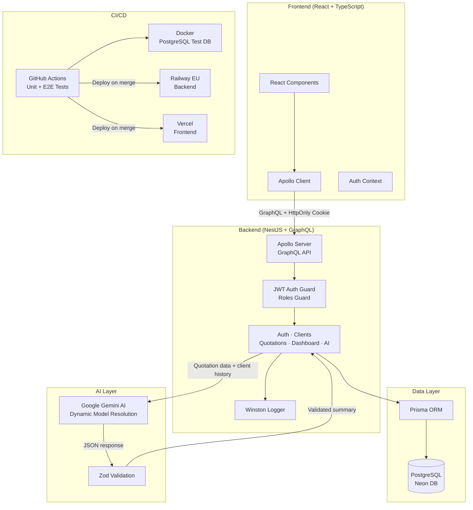

# Architecture

```mermaid
graph TB
    subgraph Frontend["Frontend (React + TypeScript)"]
        UI[React Components]
        Apollo[Apollo Client]
        Auth[Auth Context]
    end

    subgraph Backend["Backend (NestJS + GraphQL)"]
        GQL[Apollo Server\nGraphQL API]
        Guards[JWT Auth Guard\nRoles Guard]
        Modules[Auth · Clients\nQuotations · Dashboard · AI]
        Logger[Winston Logger]
    end

    subgraph Data["Data Layer"]
        Prisma[Prisma ORM]
        DB[(PostgreSQL\nNeon DB)]
    end

    subgraph AI["AI Layer"]
        Gemini[Google Gemini AI\nDynamic Model Resolution]
        Zod[Zod Validation]
    end

    subgraph CI["CI/CD"]
        GHA[GitHub Actions\nUnit + E2E Tests]
        Docker[Docker\nPostgreSQL Test DB]
        Railway[Railway EU\nBackend]
        Vercel[Vercel\nFrontend]
    end

    UI --> Apollo
    Apollo -->|GraphQL + HttpOnly Cookie| GQL
    GQL --> Guards
    Guards --> Modules
    Modules --> Logger
    Modules --> Prisma
    Prisma --> DB
    Modules -->|Quotation data + client history| Gemini
    Gemini -->|JSON response| Zod
    Zod -->|Validated summary| Modules
    GHA --> Docker
    GHA -->|Deploy on merge| Railway
    GHA -->|Deploy on merge| Vercel
```