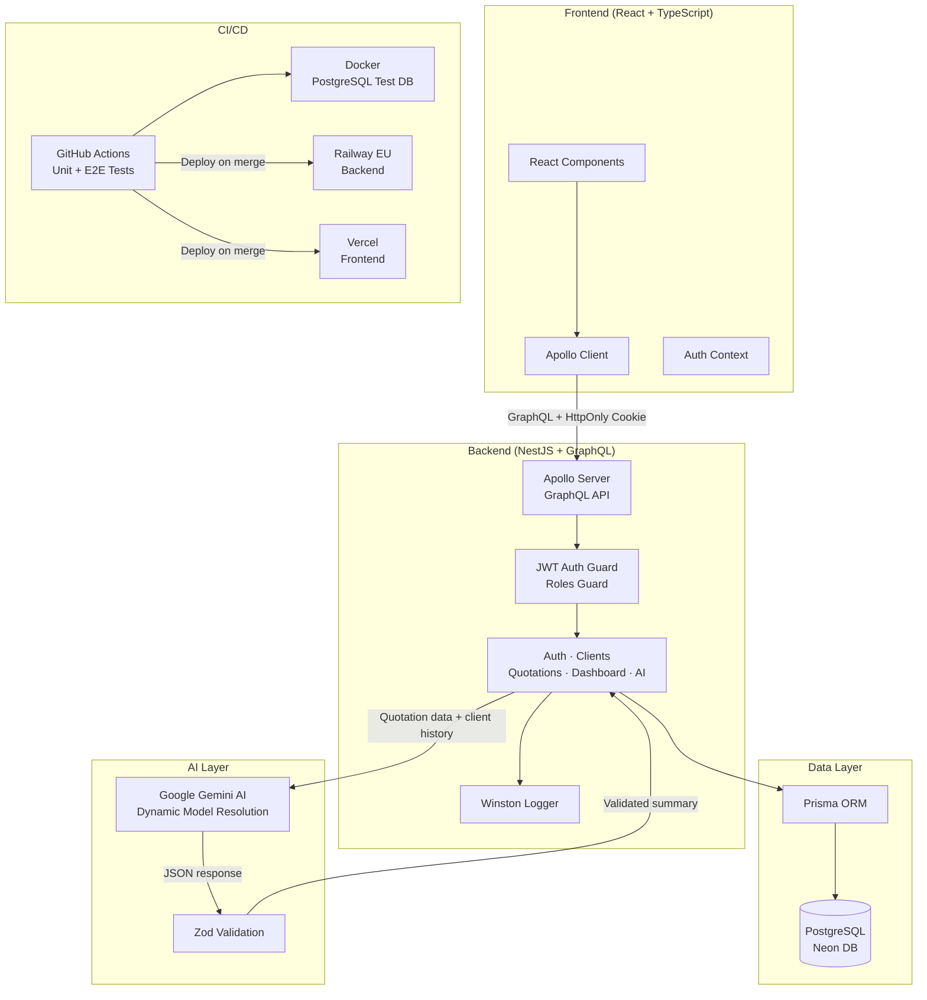

# Architecture

```mermaid
graph TB
    subgraph Frontend["Frontend (React + TypeScript)"]
        UI[React Components]
        Apollo[Apollo Client]
        Auth[Auth Context]
    end

    subgraph Backend["Backend (NestJS + GraphQL)"]
        GQL[Apollo Server<br/>GraphQL API]
        Guards[JWT Auth Guard<br/>Roles Guard]
        Modules[Auth · Clients<br/>Quotations · Dashboard · AI]
        Logger[Winston Logger]
    end

    subgraph Data["Data Layer"]
        Prisma[Prisma ORM]
        DB[(PostgreSQL<br/>Neon DB)]
    end

    subgraph AI["AI Layer"]
        Gemini[Google Gemini AI<br/>Dynamic Model Resolution]
        Zod[Zod Validation]
    end

    subgraph CI["CI/CD"]
        GHA[GitHub Actions<br/>Unit + E2E Tests]
        Docker[Docker<br/>PostgreSQL Test DB]
        Railway[Railway EU<br/>Backend]
        Vercel[Vercel<br/>Frontend]
    end

    UI --> Apollo
    Apollo -->|GraphQL + HttpOnly Cookie| GQL
    GQL --> Guards
    Guards --> Modules
    Modules --> Logger
    Modules --> Prisma
    Prisma --> DB
    Modules -->|Quotation data + client history| Gemini
    Gemini -->|JSON response| Zod
    Zod -->|Validated summary| Modules
    GHA --> Docker
    GHA -->|Deploy on merge| Railway
    GHA -->|Deploy on merge| Vercel
```