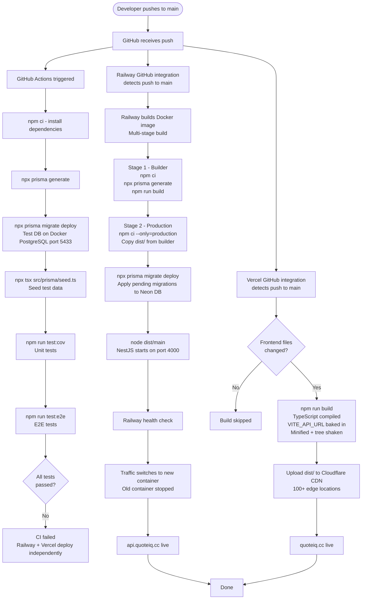

# CI/CD Flow

```mermaid
flowchart TD
    Dev([Developer pushes to main])
    Dev --> GH[GitHub receives push]

    GH --> GHA[GitHub Actions triggered]
    GHA --> Install[npm ci - install dependencies]
    Install --> PrismaGen[npx prisma generate]
    PrismaGen --> Migrate[npx prisma migrate deploy<br/>Test DB on Docker PostgreSQL port 5433]
    Migrate --> Seed[npx tsx src/prisma/seed.ts<br/>Seed test data]
    Seed --> Unit[npm run test:cov<br/>Unit tests]
    Unit --> E2E[npm run test:e2e<br/>E2E tests]

    E2E --> CIPass{All tests<br/>passed?}

    CIPass -->|No| Block[CI failed<br/>Railway + Vercel deploy independently]

    GH --> RailwayTrigger[Railway GitHub integration<br/>detects push to main]
    GH --> VercelTrigger[Vercel GitHub integration<br/>detects push to main]

    RailwayTrigger --> DockerBuild[Railway builds Docker image<br/>Multi-stage build]
    DockerBuild --> Stage1[Stage 1 - Builder<br/>npm ci<br/>npx prisma generate<br/>npm run build]
    Stage1 --> Stage2[Stage 2 - Production<br/>npm ci --only=production<br/>Copy dist/ from builder]
    Stage2 --> MigrateProd[npx prisma migrate deploy<br/>Apply pending migrations to Neon DB]
    MigrateProd --> Start[node dist/main<br/>NestJS starts on port 4000]
    Start --> Health[Railway health check]
    Health --> Switch[Traffic switches to new container<br/>Old container stopped]
    Switch --> BackendLive[api.quoteiq.cc live]

    VercelTrigger --> IgnoredCheck{Frontend files<br/>changed?}
    IgnoredCheck -->|No| Skip[Build skipped]
    IgnoredCheck -->|Yes| VBuild[npm run build<br/>TypeScript compiled<br/>VITE_API_URL baked in<br/>Minified + tree shaken]
    VBuild --> VDeploy[Upload dist/ to Cloudflare CDN<br/>100+ edge locations]
    VDeploy --> FrontendLive[quoteiq.cc live]

    BackendLive --> Done
    FrontendLive --> Done
```
