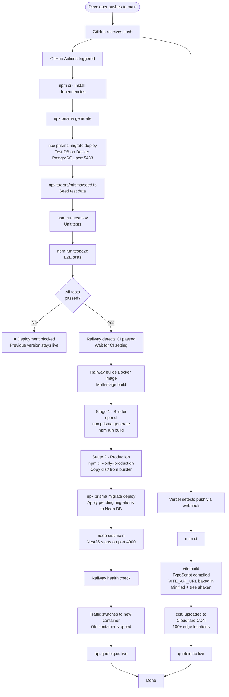

# CI/CD Flow

```mermaid
flowchart TD
    Dev([Developer pushes to main])
    Dev --> GH[GitHub receives push]

    GH --> GHA[GitHub Actions triggered]
    GHA --> Install[npm ci - install dependencies]
    Install --> PrismaGen[npx prisma generate]
    PrismaGen --> Migrate[npx prisma migrate deploy\nTest DB on Docker PostgreSQL port 5433]
    Migrate --> Seed[npx tsx src/prisma/seed.ts\nSeed test data]
    Seed --> Unit[npm run test:cov\nUnit tests]
    Unit --> E2E[npm run test:e2e\nE2E tests]

    E2E --> CIPass{All tests\npassed?}

    CIPass -->|No| Block[❌ Deployment blocked\nPrevious version stays live]
    CIPass -->|Yes| RailwayTrigger[Railway detects CI passed\nWait for CI setting]

    RailwayTrigger --> DockerBuild[Railway builds Docker image\nMulti-stage build]
    DockerBuild --> Stage1[Stage 1 - Builder\nnpm ci\nnpx prisma generate\nnpm run build]
    Stage1 --> Stage2[Stage 2 - Production\nnpm ci --only=production\nCopy dist/ from builder]
    Stage2 --> MigrateProd[npx prisma migrate deploy\nApply pending migrations to Neon DB]
    MigrateProd --> Start[node dist/main\nNestJS starts on port 4000]
    Start --> Health[Railway health check]
    Health --> Switch[Traffic switches to new container\nOld container stopped]
    Switch --> BackendLive[api.quoteiq.cc live]

    GH --> Vercel[Vercel detects push via webhook]
    Vercel --> VInstall[npm ci]
    VInstall --> VBuild[vite build\nTypeScript compiled\nVITE_API_URL baked in\nMinified + tree shaken]
    VBuild --> CDN[dist/ uploaded to\nCloudflare CDN\n100+ edge locations]
    CDN --> FrontendLive[quoteiq.cc live]

    BackendLive --> Done
    FrontendLive --> Done
```