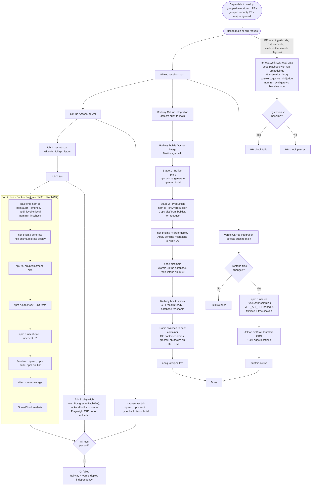

# CI/CD Flow

```mermaid
flowchart TD
    Dev([Push to main or pull request])
    Dev --> GH[GitHub receives push]

    GH --> GHA[GitHub Actions: ci.yml]
    GHA --> Secret[Job 1: secret-scan<br/>Gitleaks, full git history]
    Secret --> Test[Job 2: test]

    subgraph TestJob [Job 2: test - Docker Postgres :5433 + RabbitMQ]
        BInstall[Backend: npm ci<br/>npm audit --omit=dev --audit-level=critical<br/>npm run lint:check]
        BInstall --> PrismaGen[npx prisma generate<br/>npx prisma migrate deploy]
        PrismaGen --> Seed[npx tsx src/prisma/seed-ci.ts]
        Seed --> Unit[npm run test:cov - unit tests]
        Unit --> E2E[npm run test:e2e - Supertest E2E]
        E2E --> FInstall[Frontend: npm ci, npm audit, npm run lint]
        FInstall --> FUnit[vitest run --coverage]
        FUnit --> Sonar[SonarCloud analysis]
    end
    Test --> BInstall

    Test --> PW[Job 3: playwright<br/>own Postgres + RabbitMQ, backend built and started<br/>Playwright E2E, report uploaded]
    GHA --> MCP[mcp-server job<br/>npm ci, npm audit, typecheck, tests, build]

    Sonar --> CIPass{All jobs<br/>passed?}
    PW --> CIPass
    MCP --> CIPass
    CIPass -->|No| Block[CI failed<br/>Railway + Vercel deploy independently]

    Dev -->|PR touching AI code, documents,<br/>evals or the sample playbook| Eval[llm-eval.yml: LLM eval gate<br/>seed playbook with real embeddings<br/>23 scenarios, Groq answers, gpt-4o-mini judge<br/>npm run eval:gate vs baseline.json]
    Eval --> EvalPass{Regression vs<br/>baseline?}
    EvalPass -->|Yes| EvalFail[PR check fails]
    EvalPass -->|No| EvalOk[PR check passes]

    Bot([Dependabot: weekly grouped minor/patch PRs<br/>grouped security PRs, majors ignored]) --> Dev

    GH --> RailwayTrigger[Railway GitHub integration<br/>detects push to main]
    GH --> VercelTrigger[Vercel GitHub integration<br/>detects push to main]

    RailwayTrigger --> DockerBuild[Railway builds Docker image<br/>Multi-stage build]
    DockerBuild --> Stage1[Stage 1 - Builder<br/>npm ci<br/>npx prisma generate<br/>npm run build]
    Stage1 --> Stage2[Stage 2 - Production<br/>npm ci --only=production<br/>Copy dist/ from builder, non-root user]
    Stage2 --> MigrateProd[npx prisma migrate deploy<br/>Apply pending migrations to Neon DB]
    MigrateProd --> Start[node dist/main<br/>Warms up the database, then listens on 4000]
    Start --> Health[Railway health check<br/>GET /health/ready - database reachable]
    Health --> Switch[Traffic switches to new container<br/>Old container drains: graceful shutdown on SIGTERM]
    Switch --> BackendLive[api.quoteiq.cc live]

    VercelTrigger --> IgnoredCheck{Frontend files<br/>changed?}
    IgnoredCheck -->|No| Skip[Build skipped]
    IgnoredCheck -->|Yes| VBuild[npm run build<br/>TypeScript compiled<br/>VITE_API_URL baked in<br/>Minified + tree shaken]
    VBuild --> VDeploy[Upload dist/ to Cloudflare CDN<br/>100+ edge locations]
    VDeploy --> FrontendLive[quoteiq.cc live]

    BackendLive --> Done
    FrontendLive --> Done
```
