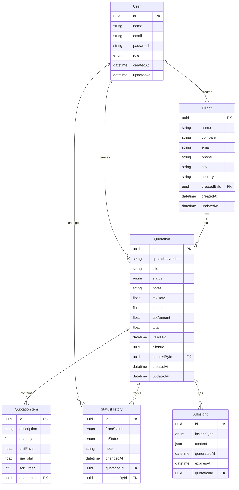

# Data Model

```mermaid
erDiagram
    User {
        uuid id PK
        string name
        string email
        string password
        enum role
        datetime createdAt
        datetime updatedAt
    }

    Client {
        uuid id PK
        string name
        string company
        string email
        string phone
        string city
        string country
        uuid createdById FK
        datetime createdAt
        datetime updatedAt
    }

    Quotation {
        uuid id PK
        string quotationNumber
        string title
        enum status
        string notes
        float taxRate
        float subtotal
        float taxAmount
        float total
        datetime validUntil
        uuid clientId FK
        uuid createdById FK
        datetime createdAt
        datetime updatedAt
    }

    QuotationItem {
        uuid id PK
        string description
        float quantity
        float unitPrice
        float lineTotal
        int sortOrder
        uuid quotationId FK
    }

    StatusHistory {
        uuid id PK
        enum fromStatus
        enum toStatus
        string note
        datetime changedAt
        uuid quotationId FK
        uuid changedById FK
    }

    AIInsight {
        uuid id PK
        enum insightType
        json content
        datetime generatedAt
        datetime expiresAt
        uuid quotationId FK
    }

    User ||--o{ Quotation : "creates"
    User ||--o{ Client : "creates"
    User ||--o{ StatusHistory : "changes"
    Client ||--o{ Quotation : "has"
    Quotation ||--o{ QuotationItem : "contains"
    Quotation ||--o{ StatusHistory : "tracks"
    Quotation ||--o{ AIInsight : "has"
```