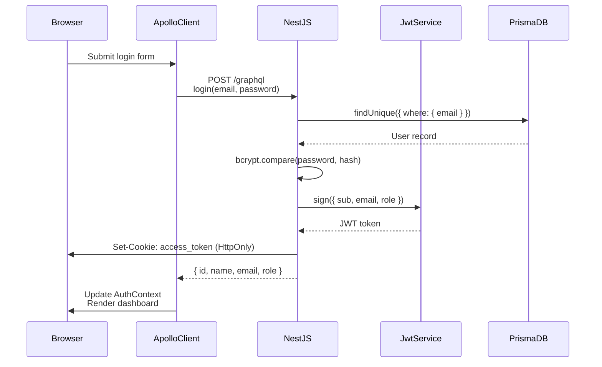

# Login Flow

```mermaid
sequenceDiagram
    participant Browser
    participant ApolloClient
    participant NestJS
    participant JwtService
    participant PrismaDB

    Browser->>ApolloClient: Submit login form
    ApolloClient->>NestJS: POST /graphql<br/>login(email, password)
    NestJS->>PrismaDB: findUnique({ where: { email } })
    PrismaDB-->>NestJS: User record
    NestJS->>NestJS: bcrypt.compare(password, hash)
    NestJS->>JwtService: sign({ sub, email, role })
    JwtService-->>NestJS: JWT token
    NestJS->>Browser: Set-Cookie: access_token (HttpOnly)
    NestJS-->>ApolloClient: { id, name, email, role }
    ApolloClient->>Browser: Update AuthContext<br/>Render dashboard
```