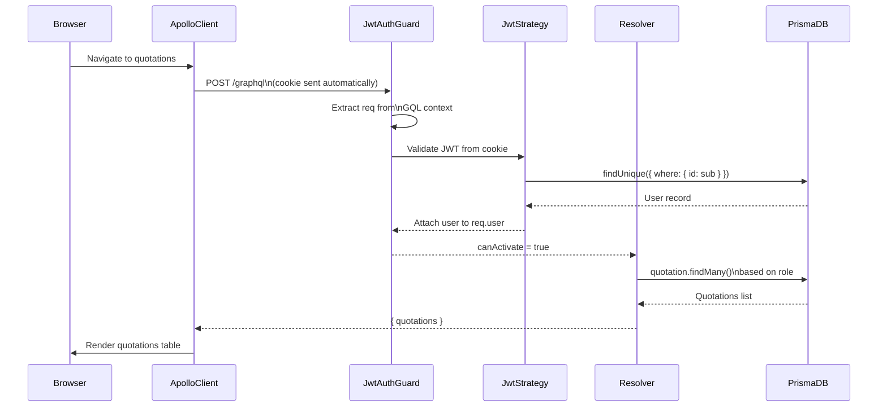

# Protected Query Flow

```mermaid
sequenceDiagram
    participant Browser
    participant ApolloClient
    participant JwtAuthGuard
    participant JwtStrategy
    participant Resolver
    participant PrismaDB

    Browser->>ApolloClient: Navigate to quotations
    ApolloClient->>JwtAuthGuard: POST /graphql\n(cookie sent automatically)
    JwtAuthGuard->>JwtAuthGuard: Extract req from\nGQL context
    JwtAuthGuard->>JwtStrategy: Validate JWT from cookie
    JwtStrategy->>PrismaDB: findUnique({ where: { id: sub } })
    PrismaDB-->>JwtStrategy: User record
    JwtStrategy-->>JwtAuthGuard: Attach user to req.user
    JwtAuthGuard-->>Resolver: canActivate = true
    Resolver->>PrismaDB: quotation.findMany()\nbased on role
    PrismaDB-->>Resolver: Quotations list
    Resolver-->>ApolloClient: { quotations }
    ApolloClient->>Browser: Render quotations table
```